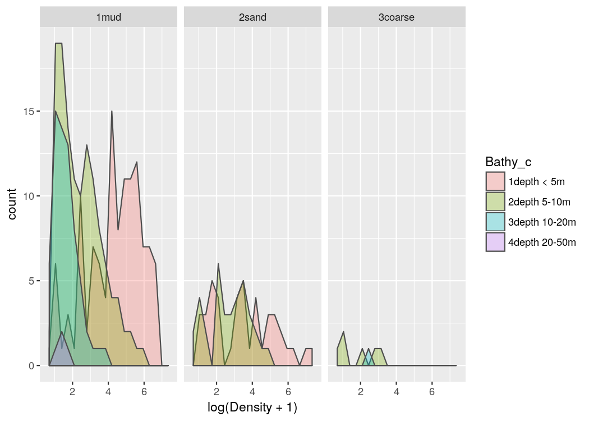
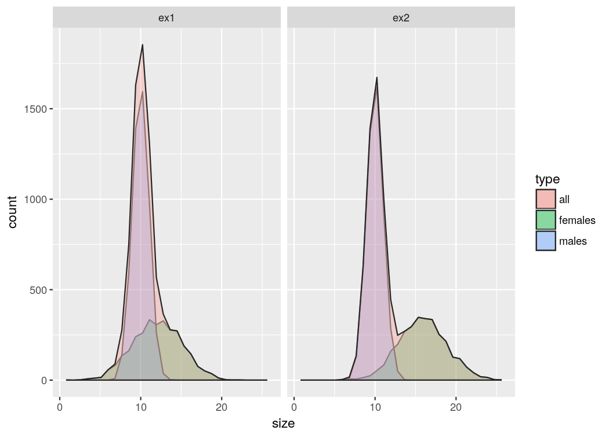

# Préface
_La version d'origine de cette formation a été créée par Olivier Le Pape et Étienne Rivot à Agrocampus Ouest (Rennes, France). Depuis mon doctorat dans leur équipe, je mets à jour constamment cette formation au gré de ma recherche et de l'évolution du logiciel R._


<!--  Header in PDF-HTML version -->

```r
  # Generated with R and rmarkdown: Roadmap version - Teacher
```

<!-- Header in R scripts -->


# Présentation de l'étude  
**Le contexte et les objectifs de votre étude définissent le type de modélisation que vous allez mettre en place sur votre jeu de données.  
Ici, nous utilisons les modèles linéaires généralisés pour produire une carte de distribution moyenne de la nourricerie de soles communes de la baie de Vilaine**.  

## Contexte
- Les zones côtières et les estuaires sont des habitats halieutiques essentiels
    + Zones à forte production
    + Nourriceries
    + Zones restreintes avec de fortes densités (Fig. \@ref(fig:figPlaiceBox))
  
(ref:figPlaiceBoxCap) Plaice box (Rijnsdorp _et al._)
  
<div class="figure" style="text-align: center">

<p class="caption">(\#fig:figPlaiceBox)(ref:figPlaiceBoxCap)</p>
</div>


- Pression anthropique élevée
    + Perte de surface disponibles (Fig. \@ref(fig:figHighPressure)a)
    + Qualité des habitats alterée (Fig. \@ref(fig:figHighPressure)b)

(ref:figHighPressureCap) (a) L'estuaire de la Seine. (b) Niveau de contamination chimique le long des côtes françaises (Ifremer, 2011)
  
- Impact sur le renouvellement des populations
    + Jeune stades = Gouleau d'étranglement
    + La taille et la qualité des nourriceries côtières influent sur la production de juvéniles

<div class="figure" style="text-align: center">

<p class="caption">(\#fig:figHighPressure)(ref:figHighPressureCap)</p>
</div>


## Objectifs
Déterminer les facteurs ayant une influence sur la distribution des poissons plats (_Solea solea_) en Baie de Vilaine et cartographier la distribution moyenne des densités.

- Cartographier les habitats potentiels nécessite:
    + Connaissance des habitats de juvéniles
    + Campagnes d'échantillonnage dans la zone d'étude
    + Connaissance des covariables environnementales ayant potentiellement de l'influence
        + Cartes exhaustives des covariables environnementales
- Une approche statistique en deux étapes
    + Modèle statistique reliant les densités aux covariables
    + Prédire les habitats potentiels


## Données
Campagne standardisée de chalut à perche dans la baie de Vilaine (Fig. \@ref(fig:figVilaineCampaign))

- 1984 – 2010
- En autumne
- Juvéniles de l'année (Âge 0)
    + Nb individus / 1000m^2^

(ref:figVilaineCampaignCap) (a) L'estuaire de la Vilaine. (b) Chalut à perche. (c) Situation des stations d'échantillonnage.

<div class="figure" style="text-align: center">

<p class="caption">(\#fig:figVilaineCampaign)(ref:figVilaineCampaignCap)</p>
</div>


## Covariables

- Bathymétrie (Fig. \@ref(fig:figCovariates)a)
    + MNT à 1000m de résolution
    + Projection Mercator

- Structure sédimentainre  (Fig. \@ref(fig:figCovariates)b)
    + Fichier shape de polygones
    + Coordonnées géographiques

- Zones biologiques (Fig. \@ref(fig:figCovariates)c)
    + Combinaison bathymétrie, sédiment, habitat
    + Fichier shape de polygones
    + Coordonnées géographiques

(ref:figCovariatesCap) Covariables en baie de Vilaine. (a) Structure sédimentaire, (b) Bathymétrie et (c) Zones biologiques.

<div class="figure" style="text-align: center">

<p class="caption">(\#fig:figCovariates)(ref:figCovariatesCap)</p>
</div>


## Ajuster un modèle de distribution d'espèces

- Croiser les données avec les cartes de covariables
    + Utiliser un modèle linéaire

- Utiliser les cartes des covariables pour la prédiction (Fig. \@ref(fig:figProcedure))
    + Une prédiction pour chaque cellule d'un raster

(ref:figProcedureCap) Procédure pour un modèle de distribution d'espèce

<div class="figure" style="text-align: center">

<p class="caption">(\#fig:figProcedure)(ref:figProcedureCap)</p>
</div>


## Exploration des données  

Prenez le temps d'explorer vos données avant toutes analyses

- Explorer les données et les covariables
    + Explorer le plan d'échantillonnage
    + Explorer les liens potentiels entre les densités et les covariables
    + Explorer les futurs paramètres de modélisation (interactions, distributions)  

Souvenez-vous toujours des objectifs de votre étude !  

Question : Que recherchons-nous dans cette exploration ?


# Préparation
## Structure des dossiers
Il convient de toujours conserver les fichiers originaux : les reprojections entraînent toujours quelques pertes, mieux vaut revenir aux originaux lorsque c'est possible.

L'arborescence de votre dossier de travail est la suivante :

-  01_Original_data
    +  DEPARTEMENTS
    +  Sedim_GDG_wgs84
    +  bathy_GDG_1000_merc (and co)
    +  Data_Vilaine_solea.csv
-  02_Outputs
-  03_Figures
-  04_Functions


## Débutons avec R
 - Créer un projet Rstudio dans le dossier principal de travail.
- Ouvrez le script R :  "Quick_AllDataModel_Teacher.R" 
 - Lister les différents sous-dossier de travail au début de votre script R


```r
# Define working directories ---------------------------------------------------
WD <- here()
# Folder of original files
origWD <- here("01_Original_data")
# Folder for outputs
saveWD <- here("02_Outputs")
# Folder where to save outputs from R
figWD <- here("03_Figures")
# Folder where complementary functions are stored
funcWD <- here("04_Functions")
```


<!-- SpatialGLM course - All data exploration -->
  


# Exploration des données
## Étapes
Souvenez-vous : Définissez ce que vous cherchez, à quelles questions vous souhaiteriez répondre !

- Explorer la répartition du plan d'échantillonnage en fonction des covariables environementales
- Explorer les données d'observation au regard des covariables environnementales pour détecter de potentielles corrélations
- Explorer les interactions entre les effets des covariables sur les observations
- Explorer les lois de distribution possibles (gaussian, log-normal, ...) des observations en fonctions des combinaisons de covariables
Les scripts qui sont fournis ne sont que des exemples, ils ne sont en aucun cas les meilleures solutions !
Faîtes vos propres tests !
 
    


## Liste des différentes étapes
    
- Lire le jeu de données spatialisé (Fig. \@ref(fig:RFigDataLL))
    
(ref:RFigDataCap) Répartition des stations d'échantillonnage


<div class="figure" style="text-align: center">
<!--html_preserve--><div id="htmlwidget-9bcd567a5cfa230a4e14" style="width:100%;height:675px;" class="leaflet html-widget"></div>
<script type="application/json" data-for="htmlwidget-9bcd567a5cfa230a4e14">{"x":{"options":{"crs":{"crsClass":"L.CRS.EPSG3857","code":null,"proj4def":null,"projectedBounds":null,"options":{}}},"calls":[{"method":"addTiles","args":["https://{s}.tile.openstreetmap.org/{z}/{x}/{y}.png",null,null,{"minZoom":0,"maxZoom":18,"maxNativeZoom":null,"tileSize":256,"subdomains":"abc","errorTileUrl":"","tms":false,"continuousWorld":false,"noWrap":false,"zoomOffset":0,"zoomReverse":false,"opacity":1,"zIndex":null,"unloadInvisibleTiles":null,"updateWhenIdle":null,"detectRetina":false,"reuseTiles":false}]},{"method":"addMarkers","args":[[47.4676666666496,47.4544999999829,47.501499999983,47.4584999999829,47.4596666666496,47.4813333333163,47.467999999983,47.4599999999829,47.4501666666496,47.4441666666496,47.4731666666497,47.4734999999829,47.4644999999829,47.497499999983,47.390333333316,47.3829999999827,47.4294999999828,47.4433333333162,47.4614999999829,47.4383333333162,47.4676666666496,47.4231666666495,47.4121666666495,47.4448333333162,47.4124999999828,47.4584999999829,47.4596666666496,47.4813333333163,47.467999999983,47.4476666666496,47.4441666666496,47.4248333333161,47.4419999999829,47.4163333333161,47.4301666666495,47.375833333316,47.4298333333161,47.390333333316,47.4054999999828,47.4614999999829,47.4463333333162,47.4383333333162,47.4509999999829,47.4933333333163,47.4676666666496,47.4544999999829,47.5128333333164,47.501499999983,47.4863333333163,47.472499999983,47.4584999999829,47.4596666666496,47.4813333333163,47.467999999983,47.4599999999829,47.4476666666496,47.4501666666496,47.4441666666496,47.4341666666496,47.4248333333161,47.4159999999828,47.4408333333162,47.4419999999829,47.4163333333161,47.4319999999828,47.4301666666495,47.4119999999828,47.4563333333162,47.4644999999829,47.3963333333161,47.375833333316,47.4406666666496,47.4828333333163,47.474999999983,47.4906666666497,47.4054999999828,47.4614999999829,47.4463333333162,47.4224999999828,47.4383333333162,47.4933333333163,47.4676666666496,47.5094999999831,47.501499999983,47.4231666666495,47.4121666666495,47.4863333333163,47.472499999983,47.4448333333162,47.4584999999829,47.4596666666496,47.4813333333163,47.467999999983,47.4599999999829,47.4441666666496,47.4341666666496,47.4731666666497,47.4159999999828,47.4408333333162,47.4574999999829,47.4734999999829,47.4821666666497,47.5008333333163,47.4419999999829,47.4163333333161,47.4119999999828,47.4563333333162,47.4644999999829,47.3963333333161,47.4009999999828,47.3831666666494,47.4389999999829,47.4406666666496,47.3898333333161,47.497499999983,47.4329999999828,47.474999999983,47.4906666666497,47.4054999999828,47.4294999999828,47.4614999999829,47.4383333333162,47.4509999999829,47.4933333333163,47.4676666666496,47.4544999999829,47.5023333333163,47.4961666666497,47.4998333333163,47.5056666666497,47.5119999999831,47.5128333333164,47.5094999999831,47.501499999983,47.4726666666497,47.4121666666495,47.4863333333163,47.472499999983,47.4584999999829,47.4596666666496,47.4813333333163,47.4599999999829,47.4501666666496,47.4441666666496,47.4341666666496,47.4248333333161,47.4731666666497,47.4734999999829,47.5008333333163,47.495499999983,47.4419999999829,47.4163333333161,47.4301666666495,47.4356666666496,47.4618333333162,47.3831666666494,47.4389999999829,47.3898333333161,47.3666666666494,47.497499999983,47.4761666666497,47.4298333333161,47.4906666666497,47.390333333316,47.3829999999827,47.367833333316,47.4054999999828,47.4294999999828,47.4433333333162,47.4463333333162,47.4224999999828,47.4933333333163,47.4544999999829,47.4971666666497,47.4961666666497,47.5101666666498,47.5119999999831,47.5094999999831,47.501499999983,47.4896666666497,47.4726666666497,47.4863333333163,47.472499999983,47.4584999999829,47.4596666666496,47.4813333333163,47.467999999983,47.4599999999829,47.4441666666496,47.4341666666496,47.4248333333161,47.4159999999828,47.4408333333162,47.4541666666496,47.4821666666497,47.5008333333163,47.4419999999829,47.4563333333162,47.4644999999829,47.375833333316,47.4389999999829,47.4406666666496,47.497499999983,47.4329999999828,47.4298333333161,47.4906666666497,47.390333333316,47.3829999999827,47.4054999999828,47.4614999999829,47.4224999999828,47.4676666666496,47.4544999999829,47.5119999999831,47.5094999999831,47.501499999983,47.4863333333163,47.472499999983,47.4448333333162,47.4584999999829,47.467999999983,47.4599999999829,47.4441666666496,47.4341666666496,47.4731666666497,47.4408333333162,47.3771666666494,47.5008333333163,47.4718333333163,47.4419999999829,47.4319999999828,47.4563333333162,47.4644999999829,47.375833333316,47.4356666666496,47.4389999999829,47.4406666666496,47.497499999983,47.4339999999828,47.4329999999828,47.4088333333161,47.4059999999828,47.4906666666497,47.390333333316,47.4614999999829,47.4463333333162,47.4224999999828,47.4383333333162,47.4933333333163,47.4676666666496,47.4731666666497,47.5101666666498,47.5128333333164,47.501499999983,47.4231666666495,47.4121666666495,47.4863333333163,47.472499999983,47.4448333333162,47.4124999999828,47.4596666666496,47.4813333333163,47.467999999983,47.4599999999829,47.4476666666496,47.4441666666496,47.4731666666497,47.4159999999828,47.3771666666494,47.4616666666496,47.375333333316,47.4734999999829,47.4821666666497,47.4718333333163,47.4419999999829,47.4163333333161,47.4319999999828,47.4301666666495,47.4563333333162,47.4644999999829,47.3963333333161,47.375833333316,47.4406666666496,47.497499999983,47.4231666666495,47.4298333333161,47.4906666666497,47.390333333316,47.4054999999828,47.4614999999829,47.4224999999828,47.4383333333162,47.4933333333163,47.4676666666496,47.4731666666497,47.4544999999829,47.5101666666498,47.5094999999831,47.501499999983,47.4726666666497,47.4231666666495,47.4121666666495,47.4863333333163,47.472499999983,47.4448333333162,47.4584999999829,47.4596666666496,47.4813333333163,47.467999999983,47.4599999999829,47.4441666666496,47.4159999999828,47.3771666666494,47.4616666666496,47.4574999999829,47.375333333316,47.4821666666497,47.4718333333163,47.4419999999829,47.4319999999828,47.4301666666495,47.4563333333162,47.4644999999829,47.3963333333161,47.4356666666496,47.4406666666496,47.497499999983,47.4231666666495,47.4298333333161,47.4906666666497,47.3549999999826,47.4614999999829,47.4676666666496,47.4544999999829,47.5101666666498,47.5128333333164,47.4231666666495,47.4863333333163,47.472499999983,47.4448333333162,47.4596666666496,47.4813333333163,47.467999999983,47.4599999999829,47.4441666666496,47.4159999999828,47.3558333333159,47.4616666666496,47.4324999999829,47.4821666666497,47.4718333333163,47.4419999999829,47.4163333333161,47.4319999999828,47.3391666666493,47.4563333333162,47.4644999999829,47.3963333333161,47.4356666666496,47.3831666666494,47.4389999999829,47.4406666666496,47.497499999983,47.4298333333161,47.3549999999826,47.4433333333162,47.4614999999829,47.4463333333162,47.4224999999828,47.4383333333162,47.4676666666496,47.4544999999829,47.5101666666498,47.5119999999831,47.5094999999831,47.4231666666495,47.4863333333163,47.472499999983,47.4448333333162,47.4596666666496,47.4813333333163,47.467999999983,47.4599999999829,47.4501666666496,47.4441666666496,47.4731666666497,47.4159999999828,47.3558333333159,47.3771666666494,47.4616666666496,47.4574999999829,47.375333333316,47.4821666666497,47.4718333333163,47.4419999999829,47.3308333333159,47.3391666666493,47.4301666666495,47.4563333333162,47.3963333333161,47.3831666666494,47.4389999999829,47.4406666666496,47.3396666666493,47.497499999983,47.4231666666495,47.4298333333161,47.4906666666497,47.3321666666493,47.3549999999826,47.4614999999829,47.4224999999828,47.4731666666497,47.4544999999829,47.5094999999831,47.4863333333163,47.472499999983,47.4448333333162,47.4596666666496,47.467999999983,47.4159999999828,47.3558333333159,47.3771666666494,47.3716666666494,47.375333333316,47.4821666666497,47.4718333333163,47.4419999999829,47.4163333333161,47.3308333333159,47.4319999999828,47.3391666666493,47.3081666666492,47.3831666666494,47.497499999983,47.4298333333161,47.3549999999826,47.4463333333162,47.4224999999828,47.4383333333162,47.4676666666496,47.4731666666497,47.4544999999829,47.5101666666498,47.5128333333164,47.4231666666495,47.4863333333163,47.472499999983,47.4596666666496,47.4813333333163,47.467999999983,47.4501666666496,47.4441666666496,47.3771666666494,47.4616666666496,47.375333333316,47.3356666666493,47.4821666666497,47.4718333333163,47.4419999999829,47.4163333333161,47.3308333333159,47.4301666666495,47.4563333333162,47.3963333333161,47.3831666666494,47.4389999999829,47.4406666666496,47.3666666666494,47.4828333333163,47.497499999983,47.4231666666495,47.4298333333161,47.4906666666497,47.3549999999826,47.4224999999828,47.4731666666497,47.4544999999829,47.5101666666498,47.501499999983,47.4863333333163,47.472499999983,47.4596666666496,47.467999999983,47.3771666666494,47.375333333316,47.4821666666497,47.4718333333163,47.4419999999829,47.4163333333161,47.3308333333159,47.3831666666494,47.4298333333161,47.3549999999826,47.4224999999828,47.4676666666496,47.4726666666497,47.4863333333163,47.472499999983,47.4596666666496,47.467999999983,47.4476666666496,47.3771666666494,47.375333333316,47.4734999999829,47.4821666666497,47.4718333333163,47.4419999999829,47.4163333333161,47.3308333333159,47.4644999999829,47.3831666666494,47.497499999983,47.4298333333161,47.3549999999826,47.390333333316,47.4614999999829,47.4463333333162,47.4224999999828,47.4383333333162,47.4731666666497,47.4544999999829,47.5094999999831,47.4726666666497,47.4231666666495,47.4121666666495,47.4863333333163,47.472499999983,47.4448333333162,47.4813333333163,47.467999999983,47.4441666666496,47.4159999999828,47.4408333333162,47.4616666666496,47.4324999999829,47.375333333316,47.4734999999829,47.4821666666497,47.4718333333163,47.4419999999829,47.3308333333159,47.4319999999828,47.3391666666493,47.4563333333162,47.3963333333161,47.4406666666496,47.3396666666493,47.4209999999828,47.3493333333159,47.4906666666497,47.3549999999826,47.4614999999829,47.4224999999828,47.4383333333162,47.4933333333163,47.4731666666497,47.4544999999829,47.5101666666498,47.5128333333164,47.5094999999831,47.501499999983,47.4231666666495,47.4863333333163,47.472499999983,47.4813333333163,47.467999999983,47.4599999999829,47.4441666666496,47.4731666666497,47.4159999999828,47.4408333333162,47.4616666666496,47.3269999999826,47.375333333316,47.4821666666497,47.4718333333163,47.4419999999829,47.3308333333159,47.3391666666493,47.4119999999828,47.4563333333162,47.3831666666494,47.3396666666493,47.3493333333159,47.4339999999828,47.3433333333159,47.4079999999828,47.4906666666497,47.3954899999828,47.3321666666493,47.3549999999826,47.4294999999828,47.4463333333162,47.4224999999828,47.4383333333162,47.4933333333163,47.4676666666496,47.4731666666497,47.4544999999829,47.5094999999831,47.4726666666497,47.4863333333163,47.472499999983,47.4448333333162,47.4596666666496,47.4813333333163,47.467999999983,47.4441666666496,47.3558333333159,47.3771666666494,47.4616666666496,47.4474999999829,47.4324999999829,47.3356666666493,47.4821666666497,47.4718333333163,47.4419999999829,47.3308333333159,47.4319999999828,47.3391666666493,47.3081666666492,47.4301666666495,47.4563333333162,47.3963333333161,47.4618333333162,47.3831666666494,47.4406666666496,47.3396666666493,47.3666666666494,47.497499999983,47.3433333333159,47.3796666666494,47.4079999999828,47.4298333333161,47.4906666666497,47.3894999999827,47.3034583333158,47.3635916666494,47.508749999983,47.3321666666493,47.3549999999826,47.390333333316,47.4294999999828,47.4463333333162,47.4383333333162,47.4933333333163,47.4676666666496,47.4731666666497,47.4544999999829,47.5023333333163,47.4971666666497,47.4961666666497,47.4998333333163,47.5056666666497,47.5101666666498,47.5094999999831,47.4863333333163,47.472499999983,47.4448333333162,47.4596666666496,47.4813333333163,47.467999999983,47.4501666666496,47.4441666666496,47.4731666666497,47.3558333333159,47.3771666666494,47.4616666666496,47.4474999999829,47.4324999999829,47.3356666666493,47.4821666666497,47.5008333333163,47.495499999983,47.4718333333163,47.4419999999829,47.3308333333159,47.4319999999828,47.3081666666492,47.4301666666495,47.4563333333162,47.3963333333161,47.4618333333162,47.4406666666496,47.3396666666493,47.3493333333159,47.497499999983,47.3433333333159,47.3796666666494,47.4079999999828,47.4298333333161,47.4906666666497,47.3894999999827,47.3034583333158,47.3298083333159,47.3321666666493,47.3549999999826,47.390333333316,47.4294999999828,47.4463333333162,47.4383333333162,47.4933333333163,47.4676666666496,47.4731666666497,47.4544999999829,47.5023333333163,47.4971666666497,47.4961666666497,47.5056666666497,47.5101666666498,47.5094999999831,47.4863333333163,47.472499999983,47.4448333333162,47.467999999983,47.4441666666496,47.4731666666497,47.3558333333159,47.4616666666496,47.4474999999829,47.4324999999829,47.3356666666493,47.4821666666497,47.495499999983,47.4718333333163,47.4419999999829,47.3308333333159,47.4301666666495,47.3963333333161,47.4618333333162,47.4406666666496,47.3396666666493,47.3898333333161,47.3493333333159,47.497499999983,47.3433333333159,47.3796666666494,47.4079999999828,47.4906666666497],[-2.5615,-2.65716666666667,-2.53633333333333,-2.58,-2.55383333333333,-2.56216666666667,-2.543,-2.536,-2.643,-2.57516666666667,-2.5775,-2.52616666666667,-2.609,-2.549,-2.646,-2.637,-2.6395,-2.6545,-2.59533333333333,-2.54383333333333,-2.5615,-2.56183333333333,-2.5375,-2.62616666666667,-2.66083333333333,-2.58,-2.55383333333333,-2.56216666666667,-2.543,-2.66666666666667,-2.57516666666667,-2.523,-2.55766666666667,-2.55216666666667,-2.53583333333333,-2.61133333333333,-2.55033333333333,-2.646,-2.64966666666667,-2.59533333333333,-2.5915,-2.54383333333333,-2.55566666666667,-2.5175,-2.5615,-2.65716666666667,-2.51333333333333,-2.53633333333333,-2.52866666666667,-2.628,-2.58,-2.55383333333333,-2.56216666666667,-2.543,-2.536,-2.66666666666667,-2.643,-2.57516666666667,-2.5655,-2.523,-2.64666666666667,-2.63766666666667,-2.55766666666667,-2.55216666666667,-2.65183333333333,-2.53583333333333,-2.52333333333333,-2.5665,-2.609,-2.63033333333333,-2.61133333333333,-2.61366666666667,-2.5775,-2.55116666666667,-2.53966666666667,-2.64966666666667,-2.59533333333333,-2.5915,-2.54083333333333,-2.54383333333333,-2.5175,-2.5615,-2.52466666666667,-2.53633333333333,-2.56183333333333,-2.5375,-2.52866666666667,-2.628,-2.62616666666667,-2.58,-2.55383333333333,-2.56216666666667,-2.543,-2.536,-2.57516666666667,-2.5655,-2.5775,-2.64666666666667,-2.63766666666667,-2.63666666666667,-2.52616666666667,-2.50883333333333,-2.5065,-2.55766666666667,-2.55216666666667,-2.52333333333333,-2.5665,-2.609,-2.63033333333333,-2.6635,-2.65316666666667,-2.529,-2.61366666666667,-2.61566666666667,-2.549,-2.519,-2.55116666666667,-2.53966666666667,-2.64966666666667,-2.6395,-2.59533333333333,-2.54383333333333,-2.55566666666667,-2.5175,-2.5615,-2.65716666666667,-2.39733333333333,-2.45283333333333,-2.46466666666667,-2.4755,-2.50033333333333,-2.51333333333333,-2.52466666666667,-2.53633333333333,-2.59066666666667,-2.5375,-2.52866666666667,-2.628,-2.58,-2.55383333333333,-2.56216666666667,-2.536,-2.643,-2.57516666666667,-2.5655,-2.523,-2.5775,-2.52616666666667,-2.5065,-2.41083333333333,-2.55766666666667,-2.55216666666667,-2.53583333333333,-2.59433333333333,-2.69666666666667,-2.65316666666667,-2.529,-2.61566666666667,-2.6475,-2.549,-2.53883333333333,-2.55033333333333,-2.53966666666667,-2.646,-2.637,-2.6255,-2.64966666666667,-2.6395,-2.6545,-2.5915,-2.54083333333333,-2.5175,-2.65716666666667,-2.43616666666667,-2.45283333333333,-2.48733333333333,-2.50033333333333,-2.52466666666667,-2.53633333333333,-2.5545,-2.59066666666667,-2.52866666666667,-2.628,-2.58,-2.55383333333333,-2.56216666666667,-2.543,-2.536,-2.57516666666667,-2.5655,-2.523,-2.64666666666667,-2.63766666666667,-2.615,-2.50883333333333,-2.5065,-2.55766666666667,-2.5665,-2.609,-2.61133333333333,-2.529,-2.61366666666667,-2.549,-2.519,-2.55033333333333,-2.53966666666667,-2.646,-2.637,-2.64966666666667,-2.59533333333333,-2.54083333333333,-2.5615,-2.65716666666667,-2.50033333333333,-2.52466666666667,-2.53633333333333,-2.52866666666667,-2.628,-2.62616666666667,-2.58,-2.543,-2.536,-2.57516666666667,-2.5655,-2.5775,-2.63766666666667,-2.627,-2.5065,-2.6445,-2.55766666666667,-2.65183333333333,-2.5665,-2.609,-2.61133333333333,-2.59433333333333,-2.529,-2.61366666666667,-2.549,-2.627,-2.519,-2.6355,-2.54883333333333,-2.53966666666667,-2.646,-2.59533333333333,-2.5915,-2.54083333333333,-2.54383333333333,-2.5175,-2.5615,-2.60933333333333,-2.48733333333333,-2.51333333333333,-2.53633333333333,-2.56183333333333,-2.5375,-2.52866666666667,-2.628,-2.62616666666667,-2.66083333333333,-2.55383333333333,-2.56216666666667,-2.543,-2.536,-2.66666666666667,-2.57516666666667,-2.5775,-2.64666666666667,-2.627,-2.67916666666667,-2.64183333333333,-2.52616666666667,-2.50883333333333,-2.6445,-2.55766666666667,-2.55216666666667,-2.65183333333333,-2.53583333333333,-2.5665,-2.609,-2.63033333333333,-2.61133333333333,-2.61366666666667,-2.549,-2.664,-2.55033333333333,-2.53966666666667,-2.646,-2.64966666666667,-2.59533333333333,-2.54083333333333,-2.54383333333333,-2.5175,-2.5615,-2.60933333333333,-2.65716666666667,-2.48733333333333,-2.52466666666667,-2.53633333333333,-2.59066666666667,-2.56183333333333,-2.5375,-2.52866666666667,-2.628,-2.62616666666667,-2.58,-2.55383333333333,-2.56216666666667,-2.543,-2.536,-2.57516666666667,-2.64666666666667,-2.627,-2.67916666666667,-2.63666666666667,-2.64183333333333,-2.50883333333333,-2.6445,-2.55766666666667,-2.65183333333333,-2.53583333333333,-2.5665,-2.609,-2.63033333333333,-2.59433333333333,-2.61366666666667,-2.549,-2.664,-2.55033333333333,-2.53966666666667,-2.66816666666667,-2.59533333333333,-2.5615,-2.65716666666667,-2.48733333333333,-2.51333333333333,-2.56183333333333,-2.52866666666667,-2.628,-2.62616666666667,-2.55383333333333,-2.56216666666667,-2.543,-2.536,-2.57516666666667,-2.64666666666667,-2.6525,-2.67916666666667,-2.67,-2.50883333333333,-2.6445,-2.55766666666667,-2.55216666666667,-2.65183333333333,-2.688,-2.5665,-2.609,-2.63033333333333,-2.59433333333333,-2.65316666666667,-2.529,-2.61366666666667,-2.549,-2.55033333333333,-2.66816666666667,-2.6545,-2.59533333333333,-2.5915,-2.54083333333333,-2.54383333333333,-2.5615,-2.65716666666667,-2.48733333333333,-2.50033333333333,-2.52466666666667,-2.56183333333333,-2.52866666666667,-2.628,-2.62616666666667,-2.55383333333333,-2.56216666666667,-2.543,-2.536,-2.643,-2.57516666666667,-2.5775,-2.64666666666667,-2.6525,-2.627,-2.67916666666667,-2.63666666666667,-2.64183333333333,-2.50883333333333,-2.6445,-2.55766666666667,-2.661,-2.688,-2.53583333333333,-2.5665,-2.63033333333333,-2.65316666666667,-2.529,-2.61366666666667,-2.61833333333333,-2.549,-2.664,-2.55033333333333,-2.53966666666667,-2.71483333333333,-2.66816666666667,-2.59533333333333,-2.54083333333333,-2.60933333333333,-2.65716666666667,-2.52466666666667,-2.52866666666667,-2.628,-2.62616666666667,-2.55383333333333,-2.543,-2.64666666666667,-2.6525,-2.627,-2.66,-2.64183333333333,-2.50883333333333,-2.6445,-2.55766666666667,-2.55216666666667,-2.661,-2.65183333333333,-2.688,-2.73466666666667,-2.65316666666667,-2.549,-2.55033333333333,-2.66816666666667,-2.5915,-2.54083333333333,-2.54383333333333,-2.5615,-2.60933333333333,-2.65716666666667,-2.48733333333333,-2.51333333333333,-2.56183333333333,-2.52866666666667,-2.628,-2.55383333333333,-2.56216666666667,-2.543,-2.643,-2.57516666666667,-2.627,-2.67916666666667,-2.64183333333333,-2.7015,-2.50883333333333,-2.6445,-2.55766666666667,-2.55216666666667,-2.661,-2.53583333333333,-2.5665,-2.63033333333333,-2.65316666666667,-2.529,-2.61366666666667,-2.6475,-2.5775,-2.549,-2.664,-2.55033333333333,-2.53966666666667,-2.66816666666667,-2.54083333333333,-2.60933333333333,-2.65716666666667,-2.48733333333333,-2.53633333333333,-2.52866666666667,-2.628,-2.55383333333333,-2.543,-2.627,-2.64183333333333,-2.50883333333333,-2.6445,-2.55766666666667,-2.55216666666667,-2.661,-2.65316666666667,-2.55033333333333,-2.66816666666667,-2.54083333333333,-2.5615,-2.59066666666667,-2.52866666666667,-2.628,-2.55383333333333,-2.543,-2.66666666666667,-2.627,-2.64183333333333,-2.52616666666667,-2.50883333333333,-2.6445,-2.55766666666667,-2.55216666666667,-2.661,-2.609,-2.65316666666667,-2.549,-2.55033333333333,-2.66816666666667,-2.646,-2.59533333333333,-2.5915,-2.54083333333333,-2.54383333333333,-2.60933333333333,-2.65716666666667,-2.52466666666667,-2.59066666666667,-2.56183333333333,-2.5375,-2.52866666666667,-2.628,-2.62616666666667,-2.56216666666667,-2.543,-2.57516666666667,-2.64666666666667,-2.63766666666667,-2.67916666666667,-2.67,-2.64183333333333,-2.52616666666667,-2.50883333333333,-2.6445,-2.55766666666667,-2.661,-2.65183333333333,-2.688,-2.5665,-2.63033333333333,-2.61366666666667,-2.61833333333333,-2.67666666666667,-2.63583333333333,-2.53966666666667,-2.66816666666667,-2.59533333333333,-2.54083333333333,-2.54383333333333,-2.5175,-2.60933333333333,-2.65716666666667,-2.48733333333333,-2.51333333333333,-2.52466666666667,-2.53633333333333,-2.56183333333333,-2.52866666666667,-2.628,-2.56216666666667,-2.543,-2.536,-2.57516666666667,-2.5775,-2.64666666666667,-2.63766666666667,-2.67916666666667,-2.76766666666667,-2.64183333333333,-2.50883333333333,-2.6445,-2.55766666666667,-2.661,-2.688,-2.52333333333333,-2.5665,-2.65316666666667,-2.61833333333333,-2.63583333333333,-2.627,-2.74183333333333,-2.6765,-2.53966666666667,-2.59072,-2.71483333333333,-2.66816666666667,-2.6395,-2.5915,-2.54083333333333,-2.54383333333333,-2.5175,-2.5615,-2.60933333333333,-2.65716666666667,-2.52466666666667,-2.59066666666667,-2.52866666666667,-2.628,-2.62616666666667,-2.55383333333333,-2.56216666666667,-2.543,-2.57516666666667,-2.6525,-2.627,-2.67916666666667,-2.68583333333333,-2.67,-2.7015,-2.50883333333333,-2.6445,-2.55766666666667,-2.661,-2.65183333333333,-2.688,-2.73466666666667,-2.53583333333333,-2.5665,-2.63033333333333,-2.69666666666667,-2.65316666666667,-2.61366666666667,-2.61833333333333,-2.6475,-2.549,-2.74183333333333,-2.68533333333333,-2.6765,-2.55033333333333,-2.53966666666667,-2.69983333333333,-2.71515833333333,-2.5824,-2.568375,-2.71483333333333,-2.66816666666667,-2.646,-2.6395,-2.5915,-2.54383333333333,-2.5175,-2.5615,-2.60933333333333,-2.65716666666667,-2.39733333333333,-2.43616666666667,-2.45283333333333,-2.46466666666667,-2.4755,-2.48733333333333,-2.52466666666667,-2.52866666666667,-2.628,-2.62616666666667,-2.55383333333333,-2.56216666666667,-2.543,-2.643,-2.57516666666667,-2.5775,-2.6525,-2.627,-2.67916666666667,-2.68583333333333,-2.67,-2.7015,-2.50883333333333,-2.5065,-2.41083333333333,-2.6445,-2.55766666666667,-2.661,-2.65183333333333,-2.73466666666667,-2.53583333333333,-2.5665,-2.63033333333333,-2.69666666666667,-2.61366666666667,-2.61833333333333,-2.63583333333333,-2.549,-2.74183333333333,-2.68533333333333,-2.6765,-2.55033333333333,-2.53966666666667,-2.69983333333333,-2.71515833333333,-2.685325,-2.71483333333333,-2.66816666666667,-2.646,-2.6395,-2.5915,-2.54383333333333,-2.5175,-2.5615,-2.60933333333333,-2.65716666666667,-2.39733333333333,-2.43616666666667,-2.45283333333333,-2.4755,-2.48733333333333,-2.52466666666667,-2.52866666666667,-2.628,-2.62616666666667,-2.543,-2.57516666666667,-2.5775,-2.6525,-2.67916666666667,-2.68583333333333,-2.67,-2.7015,-2.50883333333333,-2.41083333333333,-2.6445,-2.55766666666667,-2.661,-2.53583333333333,-2.63033333333333,-2.69666666666667,-2.61366666666667,-2.61833333333333,-2.61566666666667,-2.63583333333333,-2.549,-2.74183333333333,-2.68533333333333,-2.6765,-2.53966666666667],null,null,null,{"clickable":true,"draggable":false,"keyboard":true,"title":"","alt":"","zIndexOffset":0,"opacity":1,"riseOnHover":false,"riseOffset":250},null,null,{"showCoverageOnHover":true,"zoomToBoundsOnClick":true,"spiderfyOnMaxZoom":true,"removeOutsideVisibleBounds":true,"spiderLegPolylineOptions":{"weight":1.5,"color":"#222","opacity":0.5},"freezeAtZoom":false},null,null,null,null]},{"method":"addCircleMarkers","args":[[47.4676666666496,47.4544999999829,47.501499999983,47.4584999999829,47.4596666666496,47.4813333333163,47.467999999983,47.4599999999829,47.4501666666496,47.4441666666496,47.4731666666497,47.4734999999829,47.4644999999829,47.497499999983,47.390333333316,47.3829999999827,47.4294999999828,47.4433333333162,47.4614999999829,47.4383333333162,47.4676666666496,47.4231666666495,47.4121666666495,47.4448333333162,47.4124999999828,47.4584999999829,47.4596666666496,47.4813333333163,47.467999999983,47.4476666666496,47.4441666666496,47.4248333333161,47.4419999999829,47.4163333333161,47.4301666666495,47.375833333316,47.4298333333161,47.390333333316,47.4054999999828,47.4614999999829,47.4463333333162,47.4383333333162,47.4509999999829,47.4933333333163,47.4676666666496,47.4544999999829,47.5128333333164,47.501499999983,47.4863333333163,47.472499999983,47.4584999999829,47.4596666666496,47.4813333333163,47.467999999983,47.4599999999829,47.4476666666496,47.4501666666496,47.4441666666496,47.4341666666496,47.4248333333161,47.4159999999828,47.4408333333162,47.4419999999829,47.4163333333161,47.4319999999828,47.4301666666495,47.4119999999828,47.4563333333162,47.4644999999829,47.3963333333161,47.375833333316,47.4406666666496,47.4828333333163,47.474999999983,47.4906666666497,47.4054999999828,47.4614999999829,47.4463333333162,47.4224999999828,47.4383333333162,47.4933333333163,47.4676666666496,47.5094999999831,47.501499999983,47.4231666666495,47.4121666666495,47.4863333333163,47.472499999983,47.4448333333162,47.4584999999829,47.4596666666496,47.4813333333163,47.467999999983,47.4599999999829,47.4441666666496,47.4341666666496,47.4731666666497,47.4159999999828,47.4408333333162,47.4574999999829,47.4734999999829,47.4821666666497,47.5008333333163,47.4419999999829,47.4163333333161,47.4119999999828,47.4563333333162,47.4644999999829,47.3963333333161,47.4009999999828,47.3831666666494,47.4389999999829,47.4406666666496,47.3898333333161,47.497499999983,47.4329999999828,47.474999999983,47.4906666666497,47.4054999999828,47.4294999999828,47.4614999999829,47.4383333333162,47.4509999999829,47.4933333333163,47.4676666666496,47.4544999999829,47.5023333333163,47.4961666666497,47.4998333333163,47.5056666666497,47.5119999999831,47.5128333333164,47.5094999999831,47.501499999983,47.4726666666497,47.4121666666495,47.4863333333163,47.472499999983,47.4584999999829,47.4596666666496,47.4813333333163,47.4599999999829,47.4501666666496,47.4441666666496,47.4341666666496,47.4248333333161,47.4731666666497,47.4734999999829,47.5008333333163,47.495499999983,47.4419999999829,47.4163333333161,47.4301666666495,47.4356666666496,47.4618333333162,47.3831666666494,47.4389999999829,47.3898333333161,47.3666666666494,47.497499999983,47.4761666666497,47.4298333333161,47.4906666666497,47.390333333316,47.3829999999827,47.367833333316,47.4054999999828,47.4294999999828,47.4433333333162,47.4463333333162,47.4224999999828,47.4933333333163,47.4544999999829,47.4971666666497,47.4961666666497,47.5101666666498,47.5119999999831,47.5094999999831,47.501499999983,47.4896666666497,47.4726666666497,47.4863333333163,47.472499999983,47.4584999999829,47.4596666666496,47.4813333333163,47.467999999983,47.4599999999829,47.4441666666496,47.4341666666496,47.4248333333161,47.4159999999828,47.4408333333162,47.4541666666496,47.4821666666497,47.5008333333163,47.4419999999829,47.4563333333162,47.4644999999829,47.375833333316,47.4389999999829,47.4406666666496,47.497499999983,47.4329999999828,47.4298333333161,47.4906666666497,47.390333333316,47.3829999999827,47.4054999999828,47.4614999999829,47.4224999999828,47.4676666666496,47.4544999999829,47.5119999999831,47.5094999999831,47.501499999983,47.4863333333163,47.472499999983,47.4448333333162,47.4584999999829,47.467999999983,47.4599999999829,47.4441666666496,47.4341666666496,47.4731666666497,47.4408333333162,47.3771666666494,47.5008333333163,47.4718333333163,47.4419999999829,47.4319999999828,47.4563333333162,47.4644999999829,47.375833333316,47.4356666666496,47.4389999999829,47.4406666666496,47.497499999983,47.4339999999828,47.4329999999828,47.4088333333161,47.4059999999828,47.4906666666497,47.390333333316,47.4614999999829,47.4463333333162,47.4224999999828,47.4383333333162,47.4933333333163,47.4676666666496,47.4731666666497,47.5101666666498,47.5128333333164,47.501499999983,47.4231666666495,47.4121666666495,47.4863333333163,47.472499999983,47.4448333333162,47.4124999999828,47.4596666666496,47.4813333333163,47.467999999983,47.4599999999829,47.4476666666496,47.4441666666496,47.4731666666497,47.4159999999828,47.3771666666494,47.4616666666496,47.375333333316,47.4734999999829,47.4821666666497,47.4718333333163,47.4419999999829,47.4163333333161,47.4319999999828,47.4301666666495,47.4563333333162,47.4644999999829,47.3963333333161,47.375833333316,47.4406666666496,47.497499999983,47.4231666666495,47.4298333333161,47.4906666666497,47.390333333316,47.4054999999828,47.4614999999829,47.4224999999828,47.4383333333162,47.4933333333163,47.4676666666496,47.4731666666497,47.4544999999829,47.5101666666498,47.5094999999831,47.501499999983,47.4726666666497,47.4231666666495,47.4121666666495,47.4863333333163,47.472499999983,47.4448333333162,47.4584999999829,47.4596666666496,47.4813333333163,47.467999999983,47.4599999999829,47.4441666666496,47.4159999999828,47.3771666666494,47.4616666666496,47.4574999999829,47.375333333316,47.4821666666497,47.4718333333163,47.4419999999829,47.4319999999828,47.4301666666495,47.4563333333162,47.4644999999829,47.3963333333161,47.4356666666496,47.4406666666496,47.497499999983,47.4231666666495,47.4298333333161,47.4906666666497,47.3549999999826,47.4614999999829,47.4676666666496,47.4544999999829,47.5101666666498,47.5128333333164,47.4231666666495,47.4863333333163,47.472499999983,47.4448333333162,47.4596666666496,47.4813333333163,47.467999999983,47.4599999999829,47.4441666666496,47.4159999999828,47.3558333333159,47.4616666666496,47.4324999999829,47.4821666666497,47.4718333333163,47.4419999999829,47.4163333333161,47.4319999999828,47.3391666666493,47.4563333333162,47.4644999999829,47.3963333333161,47.4356666666496,47.3831666666494,47.4389999999829,47.4406666666496,47.497499999983,47.4298333333161,47.3549999999826,47.4433333333162,47.4614999999829,47.4463333333162,47.4224999999828,47.4383333333162,47.4676666666496,47.4544999999829,47.5101666666498,47.5119999999831,47.5094999999831,47.4231666666495,47.4863333333163,47.472499999983,47.4448333333162,47.4596666666496,47.4813333333163,47.467999999983,47.4599999999829,47.4501666666496,47.4441666666496,47.4731666666497,47.4159999999828,47.3558333333159,47.3771666666494,47.4616666666496,47.4574999999829,47.375333333316,47.4821666666497,47.4718333333163,47.4419999999829,47.3308333333159,47.3391666666493,47.4301666666495,47.4563333333162,47.3963333333161,47.3831666666494,47.4389999999829,47.4406666666496,47.3396666666493,47.497499999983,47.4231666666495,47.4298333333161,47.4906666666497,47.3321666666493,47.3549999999826,47.4614999999829,47.4224999999828,47.4731666666497,47.4544999999829,47.5094999999831,47.4863333333163,47.472499999983,47.4448333333162,47.4596666666496,47.467999999983,47.4159999999828,47.3558333333159,47.3771666666494,47.3716666666494,47.375333333316,47.4821666666497,47.4718333333163,47.4419999999829,47.4163333333161,47.3308333333159,47.4319999999828,47.3391666666493,47.3081666666492,47.3831666666494,47.497499999983,47.4298333333161,47.3549999999826,47.4463333333162,47.4224999999828,47.4383333333162,47.4676666666496,47.4731666666497,47.4544999999829,47.5101666666498,47.5128333333164,47.4231666666495,47.4863333333163,47.472499999983,47.4596666666496,47.4813333333163,47.467999999983,47.4501666666496,47.4441666666496,47.3771666666494,47.4616666666496,47.375333333316,47.3356666666493,47.4821666666497,47.4718333333163,47.4419999999829,47.4163333333161,47.3308333333159,47.4301666666495,47.4563333333162,47.3963333333161,47.3831666666494,47.4389999999829,47.4406666666496,47.3666666666494,47.4828333333163,47.497499999983,47.4231666666495,47.4298333333161,47.4906666666497,47.3549999999826,47.4224999999828,47.4731666666497,47.4544999999829,47.5101666666498,47.501499999983,47.4863333333163,47.472499999983,47.4596666666496,47.467999999983,47.3771666666494,47.375333333316,47.4821666666497,47.4718333333163,47.4419999999829,47.4163333333161,47.3308333333159,47.3831666666494,47.4298333333161,47.3549999999826,47.4224999999828,47.4676666666496,47.4726666666497,47.4863333333163,47.472499999983,47.4596666666496,47.467999999983,47.4476666666496,47.3771666666494,47.375333333316,47.4734999999829,47.4821666666497,47.4718333333163,47.4419999999829,47.4163333333161,47.3308333333159,47.4644999999829,47.3831666666494,47.497499999983,47.4298333333161,47.3549999999826,47.390333333316,47.4614999999829,47.4463333333162,47.4224999999828,47.4383333333162,47.4731666666497,47.4544999999829,47.5094999999831,47.4726666666497,47.4231666666495,47.4121666666495,47.4863333333163,47.472499999983,47.4448333333162,47.4813333333163,47.467999999983,47.4441666666496,47.4159999999828,47.4408333333162,47.4616666666496,47.4324999999829,47.375333333316,47.4734999999829,47.4821666666497,47.4718333333163,47.4419999999829,47.3308333333159,47.4319999999828,47.3391666666493,47.4563333333162,47.3963333333161,47.4406666666496,47.3396666666493,47.4209999999828,47.3493333333159,47.4906666666497,47.3549999999826,47.4614999999829,47.4224999999828,47.4383333333162,47.4933333333163,47.4731666666497,47.4544999999829,47.5101666666498,47.5128333333164,47.5094999999831,47.501499999983,47.4231666666495,47.4863333333163,47.472499999983,47.4813333333163,47.467999999983,47.4599999999829,47.4441666666496,47.4731666666497,47.4159999999828,47.4408333333162,47.4616666666496,47.3269999999826,47.375333333316,47.4821666666497,47.4718333333163,47.4419999999829,47.3308333333159,47.3391666666493,47.4119999999828,47.4563333333162,47.3831666666494,47.3396666666493,47.3493333333159,47.4339999999828,47.3433333333159,47.4079999999828,47.4906666666497,47.3954899999828,47.3321666666493,47.3549999999826,47.4294999999828,47.4463333333162,47.4224999999828,47.4383333333162,47.4933333333163,47.4676666666496,47.4731666666497,47.4544999999829,47.5094999999831,47.4726666666497,47.4863333333163,47.472499999983,47.4448333333162,47.4596666666496,47.4813333333163,47.467999999983,47.4441666666496,47.3558333333159,47.3771666666494,47.4616666666496,47.4474999999829,47.4324999999829,47.3356666666493,47.4821666666497,47.4718333333163,47.4419999999829,47.3308333333159,47.4319999999828,47.3391666666493,47.3081666666492,47.4301666666495,47.4563333333162,47.3963333333161,47.4618333333162,47.3831666666494,47.4406666666496,47.3396666666493,47.3666666666494,47.497499999983,47.3433333333159,47.3796666666494,47.4079999999828,47.4298333333161,47.4906666666497,47.3894999999827,47.3034583333158,47.3635916666494,47.508749999983,47.3321666666493,47.3549999999826,47.390333333316,47.4294999999828,47.4463333333162,47.4383333333162,47.4933333333163,47.4676666666496,47.4731666666497,47.4544999999829,47.5023333333163,47.4971666666497,47.4961666666497,47.4998333333163,47.5056666666497,47.5101666666498,47.5094999999831,47.4863333333163,47.472499999983,47.4448333333162,47.4596666666496,47.4813333333163,47.467999999983,47.4501666666496,47.4441666666496,47.4731666666497,47.3558333333159,47.3771666666494,47.4616666666496,47.4474999999829,47.4324999999829,47.3356666666493,47.4821666666497,47.5008333333163,47.495499999983,47.4718333333163,47.4419999999829,47.3308333333159,47.4319999999828,47.3081666666492,47.4301666666495,47.4563333333162,47.3963333333161,47.4618333333162,47.4406666666496,47.3396666666493,47.3493333333159,47.497499999983,47.3433333333159,47.3796666666494,47.4079999999828,47.4298333333161,47.4906666666497,47.3894999999827,47.3034583333158,47.3298083333159,47.3321666666493,47.3549999999826,47.390333333316,47.4294999999828,47.4463333333162,47.4383333333162,47.4933333333163,47.4676666666496,47.4731666666497,47.4544999999829,47.5023333333163,47.4971666666497,47.4961666666497,47.5056666666497,47.5101666666498,47.5094999999831,47.4863333333163,47.472499999983,47.4448333333162,47.467999999983,47.4441666666496,47.4731666666497,47.3558333333159,47.4616666666496,47.4474999999829,47.4324999999829,47.3356666666493,47.4821666666497,47.495499999983,47.4718333333163,47.4419999999829,47.3308333333159,47.4301666666495,47.3963333333161,47.4618333333162,47.4406666666496,47.3396666666493,47.3898333333161,47.3493333333159,47.497499999983,47.3433333333159,47.3796666666494,47.4079999999828,47.4906666666497],[-2.5615,-2.65716666666667,-2.53633333333333,-2.58,-2.55383333333333,-2.56216666666667,-2.543,-2.536,-2.643,-2.57516666666667,-2.5775,-2.52616666666667,-2.609,-2.549,-2.646,-2.637,-2.6395,-2.6545,-2.59533333333333,-2.54383333333333,-2.5615,-2.56183333333333,-2.5375,-2.62616666666667,-2.66083333333333,-2.58,-2.55383333333333,-2.56216666666667,-2.543,-2.66666666666667,-2.57516666666667,-2.523,-2.55766666666667,-2.55216666666667,-2.53583333333333,-2.61133333333333,-2.55033333333333,-2.646,-2.64966666666667,-2.59533333333333,-2.5915,-2.54383333333333,-2.55566666666667,-2.5175,-2.5615,-2.65716666666667,-2.51333333333333,-2.53633333333333,-2.52866666666667,-2.628,-2.58,-2.55383333333333,-2.56216666666667,-2.543,-2.536,-2.66666666666667,-2.643,-2.57516666666667,-2.5655,-2.523,-2.64666666666667,-2.63766666666667,-2.55766666666667,-2.55216666666667,-2.65183333333333,-2.53583333333333,-2.52333333333333,-2.5665,-2.609,-2.63033333333333,-2.61133333333333,-2.61366666666667,-2.5775,-2.55116666666667,-2.53966666666667,-2.64966666666667,-2.59533333333333,-2.5915,-2.54083333333333,-2.54383333333333,-2.5175,-2.5615,-2.52466666666667,-2.53633333333333,-2.56183333333333,-2.5375,-2.52866666666667,-2.628,-2.62616666666667,-2.58,-2.55383333333333,-2.56216666666667,-2.543,-2.536,-2.57516666666667,-2.5655,-2.5775,-2.64666666666667,-2.63766666666667,-2.63666666666667,-2.52616666666667,-2.50883333333333,-2.5065,-2.55766666666667,-2.55216666666667,-2.52333333333333,-2.5665,-2.609,-2.63033333333333,-2.6635,-2.65316666666667,-2.529,-2.61366666666667,-2.61566666666667,-2.549,-2.519,-2.55116666666667,-2.53966666666667,-2.64966666666667,-2.6395,-2.59533333333333,-2.54383333333333,-2.55566666666667,-2.5175,-2.5615,-2.65716666666667,-2.39733333333333,-2.45283333333333,-2.46466666666667,-2.4755,-2.50033333333333,-2.51333333333333,-2.52466666666667,-2.53633333333333,-2.59066666666667,-2.5375,-2.52866666666667,-2.628,-2.58,-2.55383333333333,-2.56216666666667,-2.536,-2.643,-2.57516666666667,-2.5655,-2.523,-2.5775,-2.52616666666667,-2.5065,-2.41083333333333,-2.55766666666667,-2.55216666666667,-2.53583333333333,-2.59433333333333,-2.69666666666667,-2.65316666666667,-2.529,-2.61566666666667,-2.6475,-2.549,-2.53883333333333,-2.55033333333333,-2.53966666666667,-2.646,-2.637,-2.6255,-2.64966666666667,-2.6395,-2.6545,-2.5915,-2.54083333333333,-2.5175,-2.65716666666667,-2.43616666666667,-2.45283333333333,-2.48733333333333,-2.50033333333333,-2.52466666666667,-2.53633333333333,-2.5545,-2.59066666666667,-2.52866666666667,-2.628,-2.58,-2.55383333333333,-2.56216666666667,-2.543,-2.536,-2.57516666666667,-2.5655,-2.523,-2.64666666666667,-2.63766666666667,-2.615,-2.50883333333333,-2.5065,-2.55766666666667,-2.5665,-2.609,-2.61133333333333,-2.529,-2.61366666666667,-2.549,-2.519,-2.55033333333333,-2.53966666666667,-2.646,-2.637,-2.64966666666667,-2.59533333333333,-2.54083333333333,-2.5615,-2.65716666666667,-2.50033333333333,-2.52466666666667,-2.53633333333333,-2.52866666666667,-2.628,-2.62616666666667,-2.58,-2.543,-2.536,-2.57516666666667,-2.5655,-2.5775,-2.63766666666667,-2.627,-2.5065,-2.6445,-2.55766666666667,-2.65183333333333,-2.5665,-2.609,-2.61133333333333,-2.59433333333333,-2.529,-2.61366666666667,-2.549,-2.627,-2.519,-2.6355,-2.54883333333333,-2.53966666666667,-2.646,-2.59533333333333,-2.5915,-2.54083333333333,-2.54383333333333,-2.5175,-2.5615,-2.60933333333333,-2.48733333333333,-2.51333333333333,-2.53633333333333,-2.56183333333333,-2.5375,-2.52866666666667,-2.628,-2.62616666666667,-2.66083333333333,-2.55383333333333,-2.56216666666667,-2.543,-2.536,-2.66666666666667,-2.57516666666667,-2.5775,-2.64666666666667,-2.627,-2.67916666666667,-2.64183333333333,-2.52616666666667,-2.50883333333333,-2.6445,-2.55766666666667,-2.55216666666667,-2.65183333333333,-2.53583333333333,-2.5665,-2.609,-2.63033333333333,-2.61133333333333,-2.61366666666667,-2.549,-2.664,-2.55033333333333,-2.53966666666667,-2.646,-2.64966666666667,-2.59533333333333,-2.54083333333333,-2.54383333333333,-2.5175,-2.5615,-2.60933333333333,-2.65716666666667,-2.48733333333333,-2.52466666666667,-2.53633333333333,-2.59066666666667,-2.56183333333333,-2.5375,-2.52866666666667,-2.628,-2.62616666666667,-2.58,-2.55383333333333,-2.56216666666667,-2.543,-2.536,-2.57516666666667,-2.64666666666667,-2.627,-2.67916666666667,-2.63666666666667,-2.64183333333333,-2.50883333333333,-2.6445,-2.55766666666667,-2.65183333333333,-2.53583333333333,-2.5665,-2.609,-2.63033333333333,-2.59433333333333,-2.61366666666667,-2.549,-2.664,-2.55033333333333,-2.53966666666667,-2.66816666666667,-2.59533333333333,-2.5615,-2.65716666666667,-2.48733333333333,-2.51333333333333,-2.56183333333333,-2.52866666666667,-2.628,-2.62616666666667,-2.55383333333333,-2.56216666666667,-2.543,-2.536,-2.57516666666667,-2.64666666666667,-2.6525,-2.67916666666667,-2.67,-2.50883333333333,-2.6445,-2.55766666666667,-2.55216666666667,-2.65183333333333,-2.688,-2.5665,-2.609,-2.63033333333333,-2.59433333333333,-2.65316666666667,-2.529,-2.61366666666667,-2.549,-2.55033333333333,-2.66816666666667,-2.6545,-2.59533333333333,-2.5915,-2.54083333333333,-2.54383333333333,-2.5615,-2.65716666666667,-2.48733333333333,-2.50033333333333,-2.52466666666667,-2.56183333333333,-2.52866666666667,-2.628,-2.62616666666667,-2.55383333333333,-2.56216666666667,-2.543,-2.536,-2.643,-2.57516666666667,-2.5775,-2.64666666666667,-2.6525,-2.627,-2.67916666666667,-2.63666666666667,-2.64183333333333,-2.50883333333333,-2.6445,-2.55766666666667,-2.661,-2.688,-2.53583333333333,-2.5665,-2.63033333333333,-2.65316666666667,-2.529,-2.61366666666667,-2.61833333333333,-2.549,-2.664,-2.55033333333333,-2.53966666666667,-2.71483333333333,-2.66816666666667,-2.59533333333333,-2.54083333333333,-2.60933333333333,-2.65716666666667,-2.52466666666667,-2.52866666666667,-2.628,-2.62616666666667,-2.55383333333333,-2.543,-2.64666666666667,-2.6525,-2.627,-2.66,-2.64183333333333,-2.50883333333333,-2.6445,-2.55766666666667,-2.55216666666667,-2.661,-2.65183333333333,-2.688,-2.73466666666667,-2.65316666666667,-2.549,-2.55033333333333,-2.66816666666667,-2.5915,-2.54083333333333,-2.54383333333333,-2.5615,-2.60933333333333,-2.65716666666667,-2.48733333333333,-2.51333333333333,-2.56183333333333,-2.52866666666667,-2.628,-2.55383333333333,-2.56216666666667,-2.543,-2.643,-2.57516666666667,-2.627,-2.67916666666667,-2.64183333333333,-2.7015,-2.50883333333333,-2.6445,-2.55766666666667,-2.55216666666667,-2.661,-2.53583333333333,-2.5665,-2.63033333333333,-2.65316666666667,-2.529,-2.61366666666667,-2.6475,-2.5775,-2.549,-2.664,-2.55033333333333,-2.53966666666667,-2.66816666666667,-2.54083333333333,-2.60933333333333,-2.65716666666667,-2.48733333333333,-2.53633333333333,-2.52866666666667,-2.628,-2.55383333333333,-2.543,-2.627,-2.64183333333333,-2.50883333333333,-2.6445,-2.55766666666667,-2.55216666666667,-2.661,-2.65316666666667,-2.55033333333333,-2.66816666666667,-2.54083333333333,-2.5615,-2.59066666666667,-2.52866666666667,-2.628,-2.55383333333333,-2.543,-2.66666666666667,-2.627,-2.64183333333333,-2.52616666666667,-2.50883333333333,-2.6445,-2.55766666666667,-2.55216666666667,-2.661,-2.609,-2.65316666666667,-2.549,-2.55033333333333,-2.66816666666667,-2.646,-2.59533333333333,-2.5915,-2.54083333333333,-2.54383333333333,-2.60933333333333,-2.65716666666667,-2.52466666666667,-2.59066666666667,-2.56183333333333,-2.5375,-2.52866666666667,-2.628,-2.62616666666667,-2.56216666666667,-2.543,-2.57516666666667,-2.64666666666667,-2.63766666666667,-2.67916666666667,-2.67,-2.64183333333333,-2.52616666666667,-2.50883333333333,-2.6445,-2.55766666666667,-2.661,-2.65183333333333,-2.688,-2.5665,-2.63033333333333,-2.61366666666667,-2.61833333333333,-2.67666666666667,-2.63583333333333,-2.53966666666667,-2.66816666666667,-2.59533333333333,-2.54083333333333,-2.54383333333333,-2.5175,-2.60933333333333,-2.65716666666667,-2.48733333333333,-2.51333333333333,-2.52466666666667,-2.53633333333333,-2.56183333333333,-2.52866666666667,-2.628,-2.56216666666667,-2.543,-2.536,-2.57516666666667,-2.5775,-2.64666666666667,-2.63766666666667,-2.67916666666667,-2.76766666666667,-2.64183333333333,-2.50883333333333,-2.6445,-2.55766666666667,-2.661,-2.688,-2.52333333333333,-2.5665,-2.65316666666667,-2.61833333333333,-2.63583333333333,-2.627,-2.74183333333333,-2.6765,-2.53966666666667,-2.59072,-2.71483333333333,-2.66816666666667,-2.6395,-2.5915,-2.54083333333333,-2.54383333333333,-2.5175,-2.5615,-2.60933333333333,-2.65716666666667,-2.52466666666667,-2.59066666666667,-2.52866666666667,-2.628,-2.62616666666667,-2.55383333333333,-2.56216666666667,-2.543,-2.57516666666667,-2.6525,-2.627,-2.67916666666667,-2.68583333333333,-2.67,-2.7015,-2.50883333333333,-2.6445,-2.55766666666667,-2.661,-2.65183333333333,-2.688,-2.73466666666667,-2.53583333333333,-2.5665,-2.63033333333333,-2.69666666666667,-2.65316666666667,-2.61366666666667,-2.61833333333333,-2.6475,-2.549,-2.74183333333333,-2.68533333333333,-2.6765,-2.55033333333333,-2.53966666666667,-2.69983333333333,-2.71515833333333,-2.5824,-2.568375,-2.71483333333333,-2.66816666666667,-2.646,-2.6395,-2.5915,-2.54383333333333,-2.5175,-2.5615,-2.60933333333333,-2.65716666666667,-2.39733333333333,-2.43616666666667,-2.45283333333333,-2.46466666666667,-2.4755,-2.48733333333333,-2.52466666666667,-2.52866666666667,-2.628,-2.62616666666667,-2.55383333333333,-2.56216666666667,-2.543,-2.643,-2.57516666666667,-2.5775,-2.6525,-2.627,-2.67916666666667,-2.68583333333333,-2.67,-2.7015,-2.50883333333333,-2.5065,-2.41083333333333,-2.6445,-2.55766666666667,-2.661,-2.65183333333333,-2.73466666666667,-2.53583333333333,-2.5665,-2.63033333333333,-2.69666666666667,-2.61366666666667,-2.61833333333333,-2.63583333333333,-2.549,-2.74183333333333,-2.68533333333333,-2.6765,-2.55033333333333,-2.53966666666667,-2.69983333333333,-2.71515833333333,-2.685325,-2.71483333333333,-2.66816666666667,-2.646,-2.6395,-2.5915,-2.54383333333333,-2.5175,-2.5615,-2.60933333333333,-2.65716666666667,-2.39733333333333,-2.43616666666667,-2.45283333333333,-2.4755,-2.48733333333333,-2.52466666666667,-2.52866666666667,-2.628,-2.62616666666667,-2.543,-2.57516666666667,-2.5775,-2.6525,-2.67916666666667,-2.68583333333333,-2.67,-2.7015,-2.50883333333333,-2.41083333333333,-2.6445,-2.55766666666667,-2.661,-2.53583333333333,-2.63033333333333,-2.69666666666667,-2.61366666666667,-2.61833333333333,-2.61566666666667,-2.63583333333333,-2.549,-2.74183333333333,-2.68533333333333,-2.6765,-2.53966666666667],5,null,null,{"lineCap":null,"lineJoin":null,"clickable":true,"pointerEvents":null,"className":"","stroke":false,"color":"#03F","weight":5,"opacity":0.5,"fill":true,"fillColor":"#03F","fillOpacity":0.5,"dashArray":null},null,null,null,null,null,null,null]}],"limits":{"lat":[47.3034583333158,47.5128333333164],"lng":[-2.76766666666667,-2.39733333333333]}},"evals":[],"jsHooks":[]}</script><!--/html_preserve-->
<p class="caption">(\#fig:RFigDataLL)(ref:RFigDataCap)</p>
</div>


- Ajouter une nouvelle covariable : la bathymétrie divisée en classes
    + " < 5 m", "5-10 m", "10-20 m", "20-50 m"


- Explorer la répartition des observations en fonctions des covariables
    + Centrer l'analyse sur l'année, la bathymétrie et le sédiment
    + Que remarquez-vous ?


- Explorer les covariables ayant potentiellement des effets sur les densités
    + Quelles covariables pourraient avoir une influence ?(Fig. \@ref(fig:RFigHistGG))  

(ref:RFigHistCap) Densités (log-transformées) en fonction de la bathymétrie et des sédiments


<div class="figure" style="text-align: center">

<p class="caption">(\#fig:RFigHistGG)(ref:RFigHistCap)</p>
</div>


Les modèles statistiques que nous allons utiliser peuvent se résumer de cette façon :
$$Density = Covar1 + Covar2 + Noise$$
Comme vous le savez, on chercher toujours à savoir si les données sont gaussienne pour pouvoir procéder à l'analyse statistique. Si elles ne sont pas gaussienne, nous devons définir le type de distribution pour pouvoir utiliser une transformation de données.

- Explorer la distribution des données
  +  Quelle est la distribution la plus intéressante ? 

La figure \@ref(fig:RFigDistrib) montre différents exemples de distributions.

(ref:RFigDistribCap) Différents exemples de distributions  
<div class="figure" style="text-align: center">

<p class="caption">(\#fig:RFigDistrib)(ref:RFigDistribCap)</p>
</div>


Exemple de l'effet de deux facteurs (Fig. \@ref(fig:RFigTwoFact))

(ref:RFigTwoFactCap) Differents effets de deux facteurs

-  Qu'en pensez-vous ? 
<div class="figure" style="text-align: center">

<p class="caption">(\#fig:RFigTwoFact)(ref:RFigTwoFactCap)</p>
</div>


- Explorer les interactions potentielles entre les covariables
    + Qu'en pensez-vous ?


    + Comme aide à l'interprétation, utiliser l'exemple théorique de la figure \@ref(fig:RFigExInteractions)

(ref:RFigExInteractionsCap) Interaction entre traitements et température

<div class="figure" style="text-align: center">

<p class="caption">(\#fig:RFigExInteractions)(ref:RFigExInteractionsCap)</p>
</div>


<!-- SpatialGLM course - All data model -->


# Modélisation
## Étapes
Souvenez-vous: Définissez ce que vous cherchez, à quelles questions vous souhaiteriez répondre !

- Tester les différentes formes de modèles au regard des combinaisons de covariables et des formes de distributions des résidus
- Comparer les modèles à l'aide des outils statistiques à disposition (AIC, anova, …), de la validation croisée mais aussi de la connaissance du jeu de données et des questions ciblées
- Analyser les résidus des modèles. Analyser leur distribution et s'assurer que les hypothèses de construction sont vérifiées.  
C'est seulement lorsque les hypothèses sur la distribution des résidus sont vérifiées, que les covariables et les interactions sélectionnées peuvent commencer à être interprétées...
Les scripts qui sont fournis ne sont que des exemples, ils ne sont en aucun cas les meilleures solutions !
Faîtes vos propres tests !
  


## Interpréter les sorties de modèles
Lorsque vous ajustez un modèle linéaire (lm ou glm), vous pouvez utiliser différents tests statistiques et visuels qui répondent à différentes questions. Votre question principale pourrait être :

- "Est-ce que mes covariables ont un effet sur mes observations ?". En réalité, ce n'est pas exactement la question à laquelle va répondre votre modèle. Ce serait plutôt "Est-ce que les covariables que j'ai utilisées expliquent une part de la variabilité de mes observations ?"  

Pour que vous puissiez interpréter les différentes sorties de modèles, dans ce document, nous allons regarder le modèle suivant :
$$lm(Density ~ Bathy + Sedim, data = dataset)$$
_Ce modèle n'est pas forcément le meilleur modèle à choisir !_  

### Summary(lm)
Cette fonction montre un tableau de tests de significativité (Table \@ref(tab:RTableSummary)). Ce sont des tests de Student. Ils testent si la valeur estimée pour un effet est ou non significativement différente de zéro. Ainsi, si une covariable a un effet non significativement différent de l'effet nul, il est probablement inutile de la conserver dans le modèle.


- Ici, ce qui est appelé "Intercept" est l'effet de base. Dans une équation $y = a.x + b$, l'"intercept" serait $b$. Ici, c'est un peu différent car il y a des covariables au format facteur ("Sedim"). Dans cet exemple, l'"intercept" montre une "p-value" proche de zéro, ce qui signifie que son effet (`estimate ~ 100`) est significativement différent de zéro.
- La covariable "Bathy" est continue. Dans une équation de type $y = a.x + b$ ce serait $a$. Dans cet exemple, son effet `estimate ~ 6`, est significativement différent de zéro (`p-value ~ 0`).
- La covariable "Sedim" est un facteur à trois niveaux. Dans le "summary", vous ne pouvez en voir que deux ("2sand", "3coarse"). En réalité, les effets des niveaux de facteur ($estimate$) sont comparés au premier niveau ("1mud"), pour lequel l'effet est égal à zéro. Dans l'équation $Y = a*Bathy + b[Sedim] + c$, l'estimation de la moyenne Y pour `Sedim = "1mud"` est $Y = a*Bathy + 0 + c$. Dans les résultats du tableau, `b["2sand"]` est donc non significativement différent de `b["1mud"] = 0`, et, `b["3coarse"]` avec une `p-value = 0.07`, n'est pas non plus significativement différent de `b["1mud"] = 0`.


Table: (\#tab:RTableSummary)Exemple d'une sortie de `summary(lm)`

                Estimate   Std. Error   t value   Pr(>|t|)
-------------  ---------  -----------  --------  ---------
(Intercept)        173.4        14.27    12.152      0.000
Bathy               14.5         1.71     8.472      0.000
Sedim2sand         -19.5        19.07    -1.020      0.308
Sedim3coarse       -39.4        57.21    -0.689      0.491


### Analyse de résidus
Une hypothèse de construction d'un modèle linéaire est l'homoscédasticité, aussi appelée homogénéité de la variance. Cela signifie que la variance de la réponse `y` est la même quelque soit la valeur du prédicteur  `x`. Dans un modèle Gaussien classique ajustant `x` à `y` ainsi: $y = a.x + b + \epsilon$, la variable $\epsilon$ représente les résidus du modèle. Ils sont supposés être centrés sur zéro et avec une variance Gaussienne, leur distribution suivant ainsi la loi Gaussienne $\epsilon \sim N(0, \sigma)$  
Lorsqu'on simule un tel modèle, par exemple $y = 2.x + 5 + \epsilon$, on observe la figure \@ref(fig:RFigResidualsExemple), avec une homogénéité de la distribution des observations autour de l'ajustement, et une distribution Gaussienne des résidus comme le montrent l'histogramme et le "qqplot".

(ref:RFigResidualsExempleCap) Simulation d'une relation linéaire entre x et y avec un résidu Gaussien.


```r
# Example of homogeneous residuals
n <- 1000
epsilon <- rnorm(n, 0, 5)
x <- runif(n, 0, 10)
y <- 2*x + 5 + epsilon

par(mfrow = c(1,3))
plot(x, y, pch = 20)
abline(5, 2, col = "red", lwd = 2)
hist(epsilon, breaks = 20, col = "grey")
qqnorm(epsilon); qqline(epsilon, col = "red")
```

<div class="figure" style="text-align: center">

<p class="caption">(\#fig:RFigResidualsExemple)(ref:RFigResidualsExempleCap)</p>
</div>


À partir de cet exemple, vous pouvez définir les diagnostics graphiques nécessaires pour vérifier vos hypothèses de construction de modèle. Lorsqu'on utilise le même modèle que précédemment (Fig.\@ref(fig:RFigResidualsDiag)) :

- `Residuals vs Fitted` - Dans cet exemple, on peut voir que la variablité des résidus augmente avec les valeurs prédites, ce qui va à l'encontre de l'homogénéité de la variance.
- `Scale-Location` est en accord avec la figure précédente car on voit une augmentation de la deviance des résidus quand les prédictions augmentent.
- `Normal Q-Q` - Cette figure appelée "qqplot" montre la divergence entre les quantiles théoriques d'une loi Gaussienne et les quantiles réels de la distribution des résidus du modèle. La divergence est importante pour les valeurs élevées, ce qui montre une queue de distribution plus longue qu'une loi Normale.
- `Hist. of residuals` - L'histogramme des résidus est en accord avec le qqplot car on voit clairement un distribution qui n'est pas une Gaussienne centrée sur zéro. Cette distribution a une longue queue de distribution avec beaucoup plus de valeurs positives que de valeurs négatives.

  (ref:RFigResidualsDiagCap) Figures de diagnostic d'un modèle linéaire permettant de vérifier les hypothèses de construction.  
  

<div class="figure" style="text-align: center">

<p class="caption">(\#fig:RFigResidualsDiag)(ref:RFigResidualsDiagCap)</p>
</div>


### Analyse de variance
La question à laquelle répond une `anova` (avec un test du Chi-2) est : Est-ce que la covariable ajoutée augmente significativitement la vraisemblance du modèle (ou a réduit la déviance résiduelle), comparé au modèle précédent, sans cette covariable ?  
  
- `NULL` est le test pour un modèle sans covariable, c'est le modèle qui estime la moyenne : $Density \sim constant$.
- `Bathy` est le test pour un modèle uniquement avec la `Bathy` : $Density \sim Bathy$. La `p-value` est proche de zéro, indiquant que le gain de déviance expliquée en ajoutant la `Bathy` est significativement différent de zéro.
- `Sedim` est le test pour un modèle avec `Bathy` et `Sedim`, dans cet ordre : $Density \sim Bathy + Sedim$. La `p-value ~ 0.2` indique qu'il y a un risque de 20% que la déviance expliquée en ajoutant la covariable `Sedim` au modèle contenant déjà la `Bathy` soit nulle.


Table: (\#tab:RTableAnova)Exemple d'une `sortie` de anova(lm)

              Df    Sum Sq   Mean Sq   F value   Pr(>F)
----------  ----  --------  --------  --------  -------
Bathy          1   1607692   1607692    71.983    0.000
Sedim          2     32206     16103     0.721    0.487
Residuals    397   8866764     22334        NA       NA


### Critères d'Akaike (AIC) et Bayesian (BIC)
L'AIC et le BIC sont des critères de qualité d'ajustement pénalisés par le nombre de paramètres estimés. La description (traduite) de ces fonctions dans R est :

> Function générique calculant "Le Critère d'Information" d'Akaike pour un ou plusieurs modèles ajustés pour lesquels une "log-vraisemblance" peut être obtenue, en utilisant la formule $IC = -2*log-likelihood + k*npar$, où `npar` represente le nombre de paramètres estimés, et `k = 2` pour l'AIC classique, ou `k = log(n)` (`n` étant le nombre d'observations) pour le BIC ou SBC (Schwarz's Bayesian criterion).  
  
En effet, plus vous ajoutez de paramètres dans un modèle, plu svous avez de chances que le modèle s'ajuste parfaitement aux données (Table \@ref(tab:RTableAnovaEx), Fig. \@ref(fig:RFigAICExample)). L'AIC diminue avec la déviance résiduelle et augmente avec le nombre de paramètres ajustés. Plus l'AIC est bas, plus parsimonieux est le modèle.

(ref:RFigAICExampleCap) Différents modèles ajustés sur les mêmes données mais avec un nombre de paramètres ajustés croissant.


Table: (\#tab:RTableAnovaEx)Comparaison de la déviance expliquée par différents modèles avec un nombre croissant de paramètres

model    Res.Df    RSS   Df   Sum of Sq   Pr(>Chi)  "||"    df    AIC
------  -------  -----  ---  ----------  ---------  -----  ---  -----
lm1           8   3192   NA          NA         NA  ||       3   92.0
lm2           6   1272    2        1920      0.003  ||       5   86.8
lm3           4    645    2         626      0.144  ||       7   84.1

<div class="figure" style="text-align: center">

<p class="caption">(\#fig:RFigAICExample)(ref:RFigAICExampleCap)</p>
</div>


## Trouver le meilleur modèle  
La fonction lm n'est utilisée que pour des modèles avec une distribution Gaussienne des résidus. Pour tester d'autres types de distributions, il faut utiliser glm, avec un paramètre pour la famille de distribution (family). Vous pouvez utiliser des distributions qui autorisent une plus grande queue de distribution que la loi Normale. Parmis les familles disponibles, vous pouvez tester poisson, quasipoisson, Gamma, Log-gaussian.

- Quel est le meilleur modèle au regard des différents critères évoqués ?  


### Exploration des sorties du meilleur modèle

- Que pouvez-vous dire sur le diagnostic complet de votre modèle ? (Fig. \@ref(fig:RFigGLMResults))

(ref:RFigGLMResultsCap) Diagnostic du meilleur GLM sélectionné

<div class="figure" style="text-align: center">

<p class="caption">(\#fig:RFigGLMResults)(ref:RFigGLMResultsCap)</p>
</div>


## Prédictions du modèle
Lorsque vous êtes satisfaits du modèle sélectionné, vous pouvez faire des prédictions

- Utiliser le fichier csv fourni pour voir l'effet des covariables sélectionnées (Fig. \@ref(fig:RFigGLMPredict))

(ref:RFigGLMPredictCap) Prédictions du meilleur GLM sélectionné

<div class="figure" style="text-align: center">

<p class="caption">(\#fig:RFigGLMPredict)(ref:RFigGLMPredictCap)</p>
</div>


<!-- Only for Quick method -->


<!--chapter:end:00_MainFile.Rmd-->

