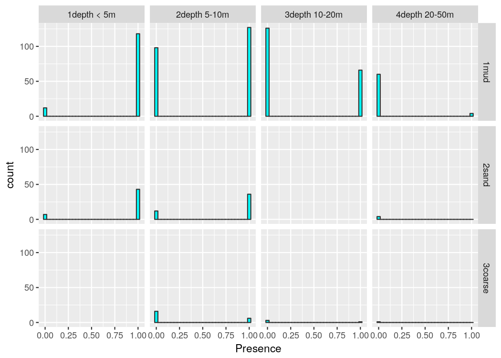
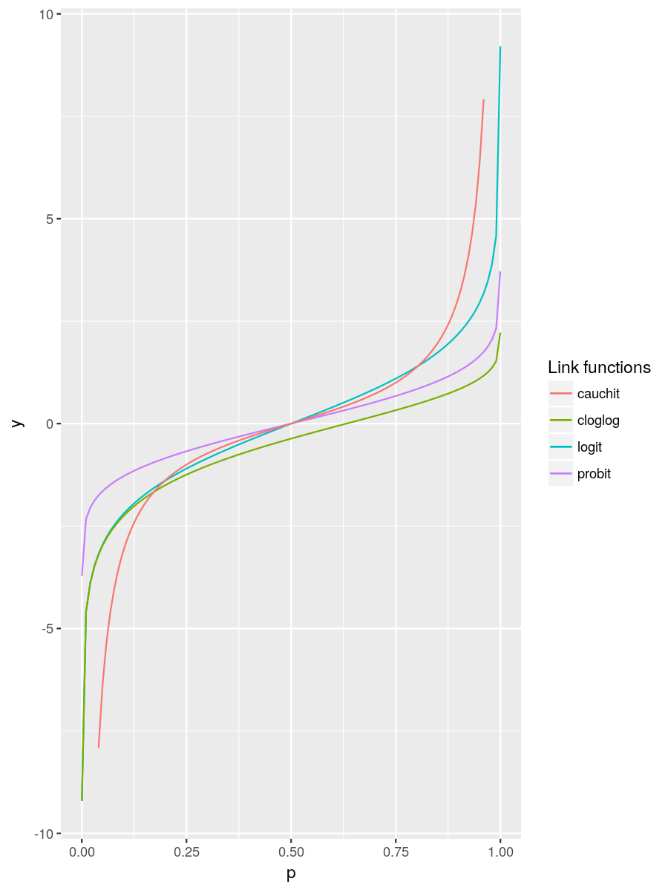
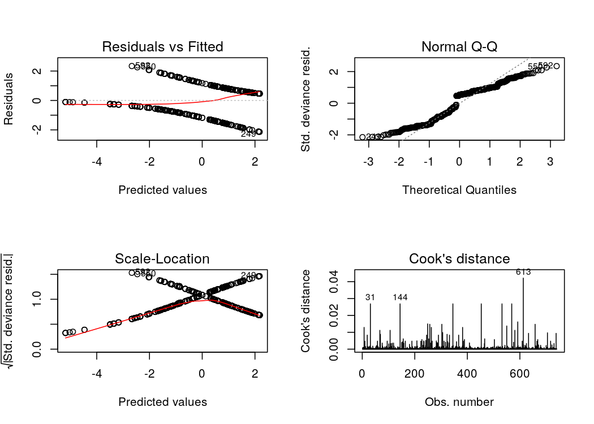
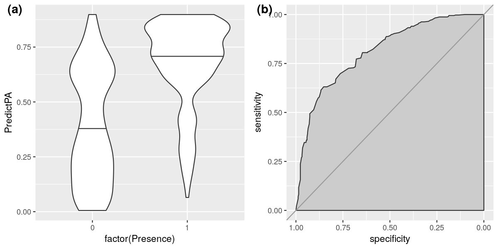

# Préface
_La version d'origine de cette formation a été créée par Olivier Le Pape et Étienne Rivot à Agrocampus Ouest (Rennes, France). Depuis mon doctorat dans leur équipe, je mets à jour constamment cette formation au gré de ma recherche et de l'évolution du logiciel R._


<!--  Header in PDF-HTML version -->

```r
  # Generated with R and rmarkdown: Roadmap version - Teacher
```

<!-- Header in R scripts -->


# Présentation de l'étude  
**Le contexte et les objectifs de votre étude définissent le type de modélisation que vous allez mettre en place sur votre jeu de données.  
Ici, nous utilisons les modèles linéaires généralisés pour produire une carte de distribution moyenne de la nourricerie de soles communes de la baie de Vilaine**.  

## Contexte
- Les zones côtières et les estuaires sont des habitats halieutiques essentiels
    + Zones à forte production
    + Nourriceries
    + Zones restreintes avec de fortes densités (Fig. \@ref(fig:figPlaiceBox))
  
(ref:figPlaiceBoxCap) Plaice box (Rijnsdorp _et al._)
  
<div class="figure" style="text-align: center">

<p class="caption">(\#fig:figPlaiceBox)(ref:figPlaiceBoxCap)</p>
</div>


- Pression anthropique élevée
    + Perte de surface disponibles (Fig. \@ref(fig:figHighPressure)a)
    + Qualité des habitats alterée (Fig. \@ref(fig:figHighPressure)b)

(ref:figHighPressureCap) (a) L'estuaire de la Seine. (b) Niveau de contamination chimique le long des côtes françaises (Ifremer, 2011)
  
- Impact sur le renouvellement des populations
    + Jeune stades = Gouleau d'étranglement
    + La taille et la qualité des nourriceries côtières influent sur la production de juvéniles

<div class="figure" style="text-align: center">

<p class="caption">(\#fig:figHighPressure)(ref:figHighPressureCap)</p>
</div>


## Objectifs
Déterminer les facteurs ayant une influence sur la distribution des poissons plats (_Solea solea_) en Baie de Vilaine et cartographier la distribution moyenne des densités.

- Cartographier les habitats potentiels nécessite:
    + Connaissance des habitats de juvéniles
    + Campagnes d'échantillonnage dans la zone d'étude
    + Connaissance des covariables environnementales ayant potentiellement de l'influence
        + Cartes exhaustives des covariables environnementales
- Une approche statistique en deux étapes
    + Modèle statistique reliant les densités aux covariables
    + Prédire les habitats potentiels


## Données
Campagne standardisée de chalut à perche dans la baie de Vilaine (Fig. \@ref(fig:figVilaineCampaign))

- 1984 – 2010
- En autumne
- Juvéniles de l'année (Âge 0)
    + Nb individus / 1000m^2^

(ref:figVilaineCampaignCap) (a) L'estuaire de la Vilaine. (b) Chalut à perche. (c) Situation des stations d'échantillonnage.

<div class="figure" style="text-align: center">

<p class="caption">(\#fig:figVilaineCampaign)(ref:figVilaineCampaignCap)</p>
</div>


## Covariables

- Bathymétrie (Fig. \@ref(fig:figCovariates)a)
    + MNT à 1000m de résolution
    + Projection Mercator

- Structure sédimentainre  (Fig. \@ref(fig:figCovariates)b)
    + Fichier shape de polygones
    + Coordonnées géographiques

- Zones biologiques (Fig. \@ref(fig:figCovariates)c)
    + Combinaison bathymétrie, sédiment, habitat
    + Fichier shape de polygones
    + Coordonnées géographiques

(ref:figCovariatesCap) Covariables en baie de Vilaine. (a) Structure sédimentaire, (b) Bathymétrie et (c) Zones biologiques.

<div class="figure" style="text-align: center">

<p class="caption">(\#fig:figCovariates)(ref:figCovariatesCap)</p>
</div>


## Ajuster un modèle de distribution d'espèces

- Croiser les données avec les cartes de covariables
    + Utiliser un modèle linéaire

- Utiliser les cartes des covariables pour la prédiction (Fig. \@ref(fig:figProcedure))
    + Une prédiction pour chaque cellule d'un raster

(ref:figProcedureCap) Procédure pour un modèle de distribution d'espèce

<div class="figure" style="text-align: center">

<p class="caption">(\#fig:figProcedure)(ref:figProcedureCap)</p>
</div>


## Exploration des données  

Prenez le temps d'explorer vos données avant toutes analyses

- Explorer les données et les covariables
    + Explorer le plan d'échantillonnage
    + Explorer les liens potentiels entre les densités et les covariables
    + Explorer les futurs paramètres de modélisation (interactions, distributions)  

Souvenez-vous toujours des objectifs de votre étude !  

Question : Que recherchons-nous dans cette exploration ?


# Préparation
## Structure des dossiers
Il convient de toujours conserver les fichiers originaux : les reprojections entraînent toujours quelques pertes, mieux vaut revenir aux originaux lorsque c'est possible.

L'arborescence de votre dossier de travail est la suivante :

-  01_Original_data
    +  DEPARTEMENTS
    +  Sedim_GDG_wgs84
    +  bathy_GDG_1000_merc (and co)
    +  Data_Vilaine_solea.csv
-  02_Outputs
-  03_Figures
-  04_Functions


## Débutons avec R
 - Créer un projet Rstudio dans le dossier principal de travail.
- Ouvrez le script R :  "Quick_PresAbs_Teacher.R" 
 - Lister les différents sous-dossier de travail au début de votre script R


```r
# Define working directories ---------------------------------------------------
WD <- here()
# Folder of original files
origWD <- here("01_Original_data")
# Folder for outputs
saveWD <- here("02_Outputs")
# Folder where to save outputs from R
figWD <- here("03_Figures")
# Folder where complementary functions are stored
funcWD <- here("04_Functions")
```


<!-- Only for Quick method -->


## Sous-modèle Binomial
### Étapes
La procédure à adopter avec le sous-groupe de données est la même qu'avec le jeu de données complet.

- Créer les observations de présence-absences à partir du jeu de données
- Explorer ce nouveau jeu de données (Fig. \@ref(fig:RFigDataBalancePA))
- Utiliser une distribution binomiale
    + Tester les covariables, les interactions, les fonctions de lien, les critères de qualité
- Choisir le meilleur modèle

### Exploration


  
 (ref:RFigDataBalancePACap) Répartition des observations en fonction de la bathymetry et des sédiments   

<div class="figure" style="text-align: center">

<p class="caption">(\#fig:RFigDataBalancePA)(ref:RFigDataBalancePACap)</p>
</div>


### Ajuster un modèle binomial avec une fonction de lien
Le choix de la distribution pour un modèle de présence-absence est simple, c'est un modèle binomial. Cepedant, un modèle est généralement ajusté sur la base de résidus Gaussiens. Pour ajuster un modèle binomial, les données doivent être transformées de telle sorte qu'on puisse ajuster un modèle linéaire Gaussien classique dessus. Pour cela, nous utilisons une fonction de lien. La fonction de lien classique d'un modèle binomial est la fonction logit, mais ce n'est pas la seule. Vous pouvez tester cloglog, probit ou cauchit.  
La fonction logit est la suivante (Fig. \@ref(fig:RFigLinkPA)): 
$$logit(p) = log \left( p \over {1 - p}  \right)$$
Cette fonction tranforme les valeurs dans l'intervalle [0;1] en valeurs dans [-Inf;Inf], de telle sorte que le modèle ajusté soit :
$$logit(p) = Covariate1 + Covariate2 + N(0, \sigma)$$
où $p$ est la probabilité de présence que l'on peut retrouver après ajustement en utilisant la fonction inverse ($logit^{-1}$).  
  
(ref:RFigLinkPACap) Différentes fonctions de lien possibles pour un modèle binomial
  
L'analyse des résidus d'un modèle binomial est aussi à faire, même si on n'a pas vraiment le choix du modèle. Les sorties graphiques sont particulières à analyser (Fig. \@ref(fig:RFigOutputsPA)).  
  
(ref:RFigOutputsPACap) Analyse des résidus d'un modèle binomial   

<div class="figure" style="text-align: center">

<p class="caption">(\#fig:RFigLinkPA)(ref:RFigLinkPACap)</p>
</div>


<div class="figure" style="text-align: center">

<p class="caption">(\#fig:RFigOutputsPA)(ref:RFigOutputsPACap)</p>
</div>


### Qualité d'ajustement d'un modèle binomial
Une mesure couramment utilisée pour la qualité d'ajustement d'un modèle binomial est "l'aire sous la courbe" (AUC : Area Under the Curve). Un objectif des modèles binomiaux étant de prédire un succès ou un échec, et non pas seulement une probabilité de succès, on peut vouloir définir un seuil (intuitivement 0.5 par exemple) qui transforme la probabilité de présence en présence ou absence. L'AUC est en quelque sorte une probabilité de classer correctement les présences et absences. Une définition plus complète serait :

> La probabililité moyenne pour qu'une observation=1 et une observation=0 choisies de manière aléatoire dans le jeu de données montrent une probabilité de présence prédite supérieure pour l'observation=1 par rapportà celle de l'observation=0  

Ainsi, $AUC = 1$ montrerait un modèle "parfait", mais $AUC = 0.5$ montrerait un modèle plus mauvais que le hasard.  
  L'AUC s'appelle ainsi parce qu'elle est calculée à partir d'une courbe "ROC" (Receiving Operating Characteristic) qui compare le taux de vrais positifs (sensitivity) au taux de faux positifs (specificity) pour différentes valeurs de seuil (Fig. \@ref(fig:RFigAUCPA)).

(ref:RFigAUCPACap) (a) Prédiction vs Observations. (b) Courbe ROC d'un modèle binomial  

 


<div class="figure" style="text-align: center">

<p class="caption">(\#fig:RFigAUCPA)(ref:RFigAUCPACap)</p>
</div>


### Choix du meilleur seuil
  


### Validation du modèle
De même que pour le modèle sur les données positives, vous pouvez utiliser la validation croisée en $k$ parties pour sélectionner le meilleur modèle en terme de prédiction. Pour un modèle binomial, vous pouvez utiliser l'AUC sur le jeu de données de validation comme un indice de qualité d'ajustement.  


<!--chapter:end:00_MainFile.Rmd-->

